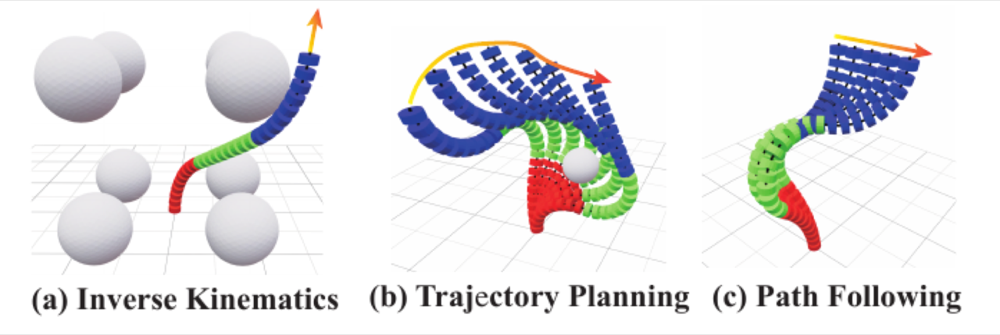

<div align="center">

<h1>CR-Solver: GPU-Accelerated Kinematics Solver for Tendon-driven Continuum Robots</h1>

<div>
    <a href='https://github.com/Noietch/DiffSoft' target='_blank'>Heqing Yang</a><sup>1</sup>&emsp;
    <a href='https://github.com/Noietch/DiffSoft' target='_blank'>Yang Yi</a><sup>1</sup>&emsp;
    <a href='https://github.com/Noietch/DiffSoft' target='_blank'>Linqing Zhong</a><sup>1</sup>&emsp;
    <a href='https://github.com/Noietch/DiffSoft' target='_blank'>Linjiang Huang</a><sup>1†</sup>&emsp;
    <a href='https://github.com/Noietch/DiffSoft' target='_blank'>Si Liu</a><sup>1†</sup>
</div>
<div>
    <sup>1</sup>Beihang University&emsp;<sup>†</sup>Corresponding authors
</div>

<div>
    <strong>IROS 2026</strong>
</div>

<div>
    <h4 align="center">
        <a href="https://github.com/Noietch/DiffSoft" target='_blank'>
        
        </a>
        <a href="https://github.com/Noietch/DiffSoft" target='_blank'>
        
        </a>
        <a href="https://github.com/Noietch/DiffSoft" target='_blank'>
        
        </a>
    </h4>
</div>

<strong>CR-Solver is a GPU-accelerated, optimization-based solver for tendon-driven continuum robots. It unifies inverse kinematics, trajectory planning, and path following within a single constrained nonlinear optimization framework, implemented in pure Python on JAX.</strong>

<div align="center">

</div>

> Continuum robots provide intrinsic compliance, high dexterity, and safe physical interaction, yet most widely used planning libraries are grounded in rigid-body assumptions. CR-Solver bridges this gap by leveraging GPU-accelerated parallel optimization to deliver fast, accurate, and constraint-aware solutions for inverse kinematics, trajectory planning, and path following.

---

</div>

## 📢 News

* **[2026-06-17]** 🔥 CR-Solver is accepted to **IROS 2026**.
* **[2026-06-30]** 🚀 Code and evaluation scripts are open-sourced.

## 💡 Highlights

* **Configuration generality**. Seamlessly supports continuum robots with various scalable capabilities and numbers of segments, including extendable (variable-length) robots.
* **Robust parallel optimization**. A two-stage strategy — massively parallel seed sampling / coarse optimization followed by a GPU-accelerated gradient-based refinement — that unleashes GPU parallelism, improving robustness to initialization and reducing susceptibility to local minima.
* **Accessible tooling**. A concise and extensible codebase implemented in pure `Python` on [`JAX`](https://github.com/jax-ml/jax) (JIT + automatic differentiation, batched trust-region Levenberg–Marquardt), lowering the barrier to adoption and research.

## 🛠️ Usage

The Python package is named `cr_solver`.

### Installation

We use [`uv`](https://github.com/astral-sh/uv) for environment management.

```bash
# CPU backend (macOS, or any machine without an NVIDIA GPU)
uv sync

# GPU backend (Linux + NVIDIA GPU + CUDA 12)
uv sync --extra cuda
```

> [!NOTE]
> GPU acceleration requires **Linux + NVIDIA GPU + CUDA 12**. On macOS, `uv sync` installs the CPU build of JAX, which is sufficient for functional testing but cannot reproduce the GPU benchmarks reported in the paper.

Alternatively, with `conda` + `pip`:

```bash
conda create -n cr_solver python=3.11 -y
conda activate cr_solver
pip install -r requirements.txt
```

### Examples

Interactive demos under `example/` and `demo/` use [`viser`](https://github.com/nerfstudio-project/viser) for browser-based visualization. After launching, open `http://localhost:8080` and drag the transform handles to solve in real time.

```bash
uv run python example/02_base_ik.py                     # base inverse kinematics
uv run python example/03_ik_with_coll.py                # collision-aware IK
uv run python example/05_motion_planning.py             # trajectory planning (trajopt / rrt / prm)
uv run python example/06_constraint_motion_planning.py  # path following
```

Minimal API for inverse kinematics:

```python
import jax
from cr_solver.robots.cc_robot import CCRobot
from cr_solver.solver import IKSolver

robot = CCRobot.from_config("configs/robots/cc.json")
solver = IKSolver(
    robot, num_seeds_init=10, num_seeds_final=1,
    total_steps=64, init_steps=6,
)
solve = jax.jit(solver.solve_ik_best)

cfg = solve(target_wxyz, target_position)  # quaternion (w, x, y, z) + xyz
pose = robot.forward_kinematics(cfg)
```

### Evaluation

Benchmarks are intended to run on a GPU (Linux). Example entry points:

```bash
# Inverse kinematics benchmark
uv run python benchmark/ik/ik_eval.py

# Motion planning benchmark (choose the number of segments)
uv run python benchmark/mp/mp_eval.py --section-num 4
```

## 📊 Results

Measured on an NVIDIA RTX 4090 (24 GB); CPU baselines on dual Intel Xeon Platinum 8480+. CR-Solver reaches near-100% success on collision-aware IK, millimeter-level accuracy on trajectory planning and path following, and orders-of-magnitude speedups over CPU baselines (Micsolver, CIDGIKc).

#### Standard Inverse Kinematics

| Method | Device | Success Rate (%) | Total Time (s) |
|--------|--------|-----------------|----------------|
| Newton-Raphson | CPU | 94.2 | 10.54 |
| EMS | CPU | 100 | 1.59 |
| **Ours** | **GPU** | **100** | **0.461** |

#### Collision-Aware Inverse Kinematics

| Method | Device | Segments | Success Rate (%) | Time (s) |
|--------|--------|----------|-----------------|-----------|
| EMS (non-extendable) | CPU | 3 | 100 | 3.05 |
| CIDGIKc (extendable) | CPU | 4 | 99 | 305.09 |
| **Ours (non-extendable)** | **GPU** | **3** | **100** | **0.428** |
| **Ours (extendable)** | **GPU** | **4** | **100** | **0.559** |

> 📈 Full benchmarks — motion-planning baselines (PRM / RRT / TrajOpt), per-stage timing, path-following per-letter errors — and all result figures are in **[docs/RESULTS.md](docs/RESULTS.md)**.

## 📝 Citation

If you find this work useful, please consider citing our paper:

```bibtex
@inproceedings{yang2026crsolver,
  title={CR-Solver: GPU-Accelerated Kinematics Solver for Tendon-driven Continuum Robots},
  author={Yang, Heqing and Yi, Yang and Zhong, Linqing and Huang, Linjiang and Liu, Si},
  booktitle={IEEE/RSJ International Conference on Intelligent Robots and Systems (IROS)},
  year={2026}
}
```

## 📄 License

This project is licensed under the Apache-2.0 License. See [LICENSE](./LICENSE) for more information.

## 🙏 Acknowledgement

This project builds upon several excellent open-source efforts, including [jaxls](https://github.com/brentyi/jaxls), [JAX](https://github.com/jax-ml/jax), [viser](https://github.com/nerfstudio-project/viser), and [CoACD](https://github.com/SarahWeiii/CoACD). We thank the authors for releasing their code.
